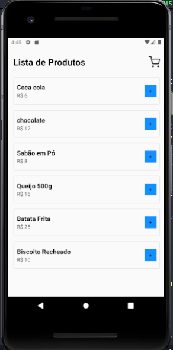
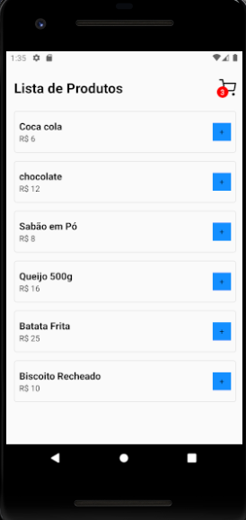
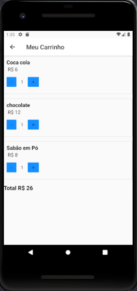

### AppCarinhoDeCompras

### Instalação do React Nativation com stack navigator

- npm install @react-navigation/native

- npm install react-native-screens react-native-safe-area-context

- npm install @react-navigation/native-stack

### Instalação do vector-icons

 - npm install react-native-vector-icons

- https://github.com/oblador/react-native-vector-icons/tree/10.x

### Prototipo

